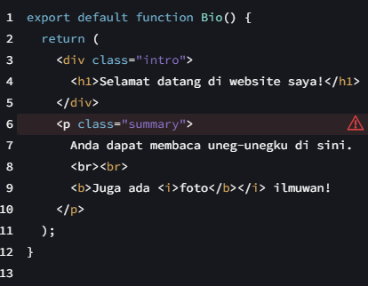

|  | Pemrograman Berbasis Framework 2024 |
|--|--|
| NIM |  2141720135 |
| Nama |  Mutiara Devita Eka Putri |
| Kelas | TI - 3A |

1. Ubah isi kode Home() sehingga dapat tampil seperti berikut dengan memanfaatkan komponen Profile() yang tadi sudah dibuat dari langkah 1 tersebut!
Capture hasilnya dan buatlah laporan di README.md. Jelaskan apa yang telah Anda pelajari dan bagaimana Anda solve error tersebut?

Pertama memodifikasi kode page.tsx sesuai kebutuhan, seperti menambahkan teks atau elemen lain di sekitar komponen Profile(). Selanjutnya pada saat dijalankan terdapat pesan error (Error: Invalid src prop (https://i.imgur.com/MK3eW3Am.jpg) on next/image, hostname "i.imgur.com" is not configured under images in your next.config.js
        See more info: https://nextjs.org/docs/messages/next-image-unconfigured-host)
Pesan error tersebut muncul karena kita menggunakan komponen next/image dari Next.js untuk menampilkan gambar yang dihosting di i.imgur.com, namun hostname tersebut belum dikonfigurasi dalam file next.config.js, Sehingga dengan menambahkan i.imgur.com ke array domains, kita memberitahu Next.js bahwa gambar dari i.imgur.com valid dan boleh diproses.

2. Capture hasilnya dan buatlah laporan di README.md. Jelaskan apa yang telah Anda pelajari dan bagaimana tampilannya saat ini?

Output yang dihasilkan dari percobaan kedua sama seperti percobaan pertama, dari membuat komponen Gallery dan mengimpornya memungkinkan untuk kita menggunakannya kembali di berbagai tempat dalam aplikasi React. Hal ini membantu menjaga kode kita agar tetap terstruktur, terorganisir, dan mudah dipelihara.

3. Silakan perbaiki kode JSX berikut ini. Anda boleh menggunakan konverter atau perbaiki secara manual.

Capture hasilnya dan buatlah laporan di README.md. Jelaskan apa yang telah Anda pelajari dan mengapa error itu bisa terjadi?

Kode tersebut error karena terdapat tag HTML yang tidak ditutup dengan benar. Tag div di awal kode tidak memiliki tag penutup.

4. - Kode Awal 

Kode di atas masih terdapat error, silakan diperbaiki.
- Kode Perbaikan

5. Buka file src/components/todolist.tsx lakukan ekstrak URL gambar ke dalam objek person.

Capture hasilnya dan buatlah laporan di README.md. Apakah ada perbedaan pada tampilan web saat ini?

Tidak terdapat perbedaan.

